# UAS

### CLO-0211

Demo: Git Installation

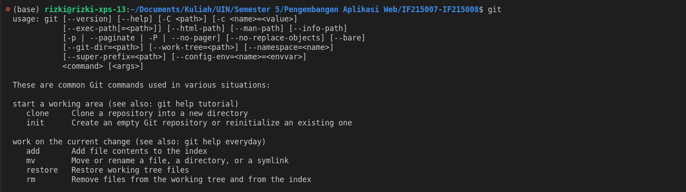

Demo : Hoppscotch / Postman access

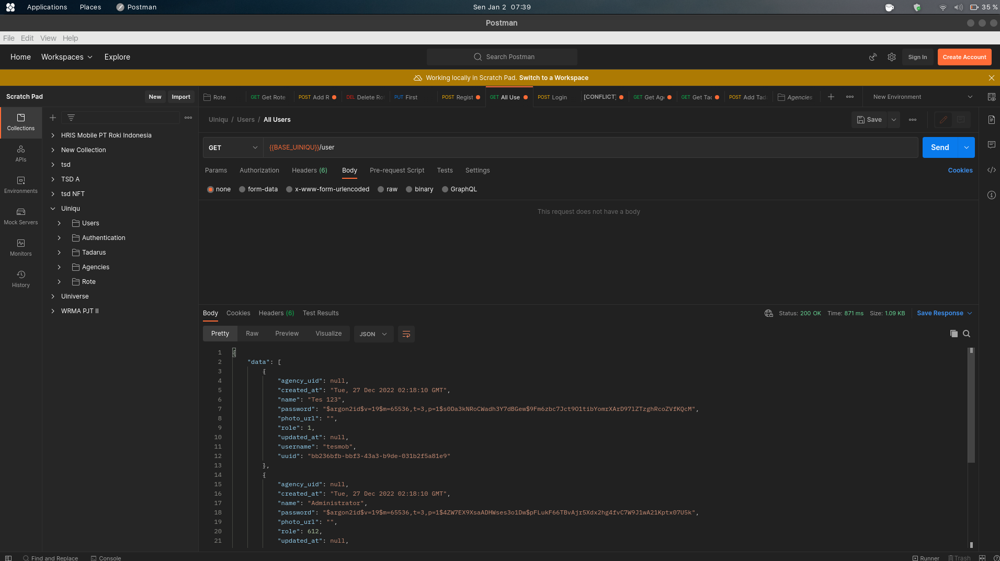

Demo : PHP & Composer installation & hello world

<i>Diganti dengan Python dan Pip</i>

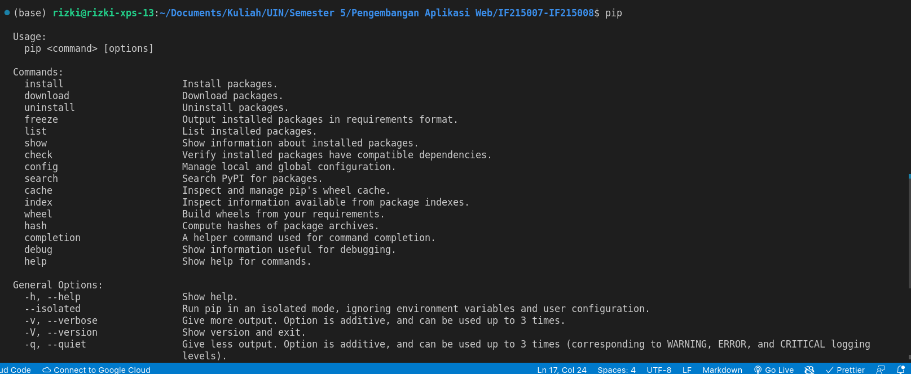

Demo : PostgreSQL / MySQL installation

<i>Diganti dengan cassandra</i>

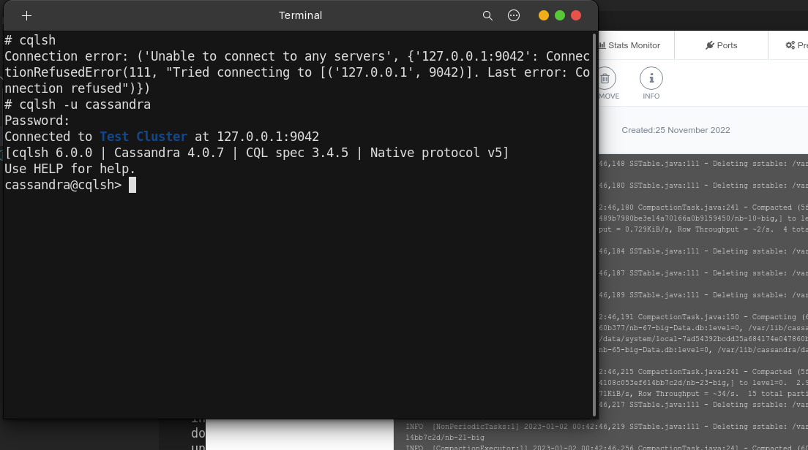

Demo : DBeaver installation & DB connection

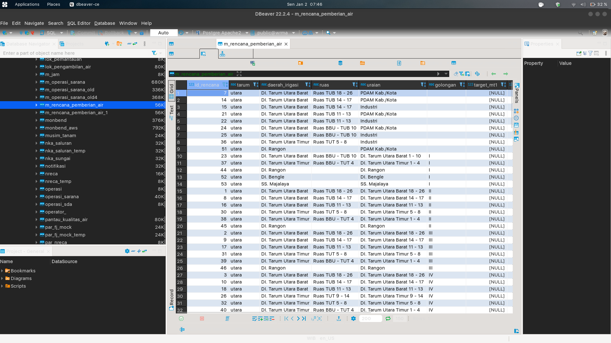

Demo : MobaXterm installation & SSH connection

<i>Saya langsung connect ssh menggunakan terminal</i>

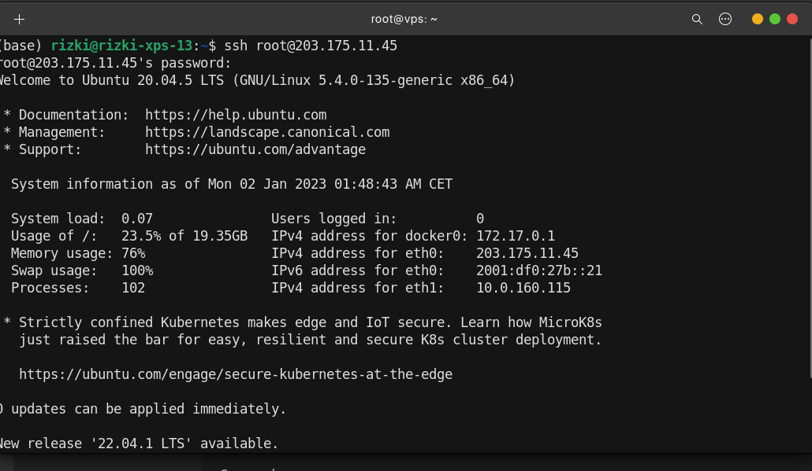

Demo : NodeJS & NPM installation

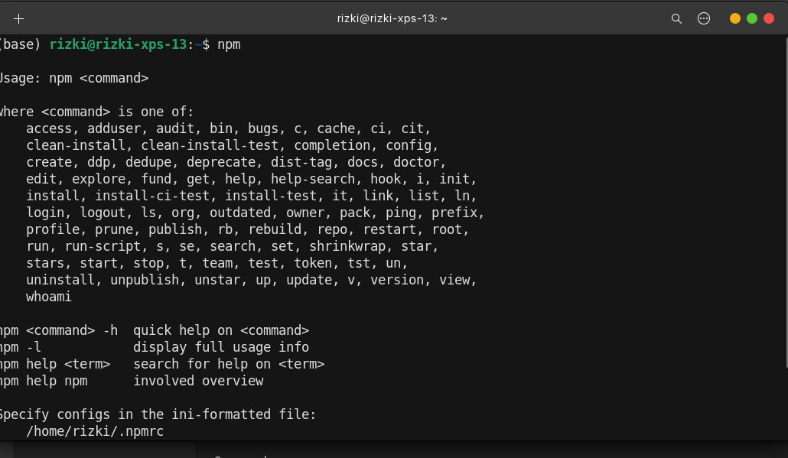

Demo : Linux server operation

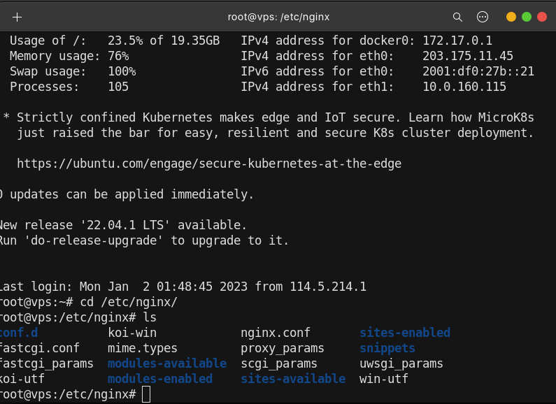

Demo : Nginx / Apache web server installation & operation

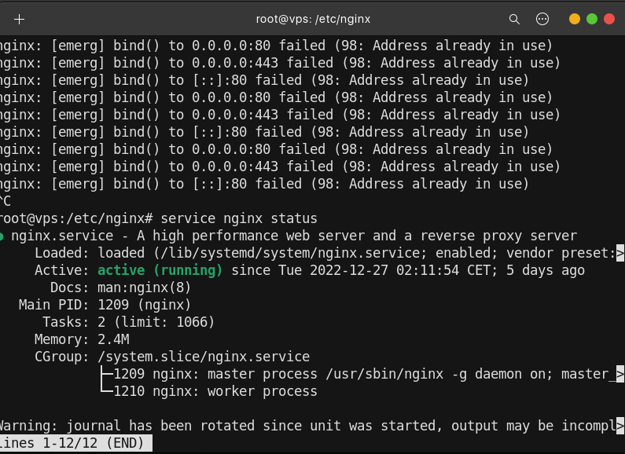

Demo : Cpanel operation

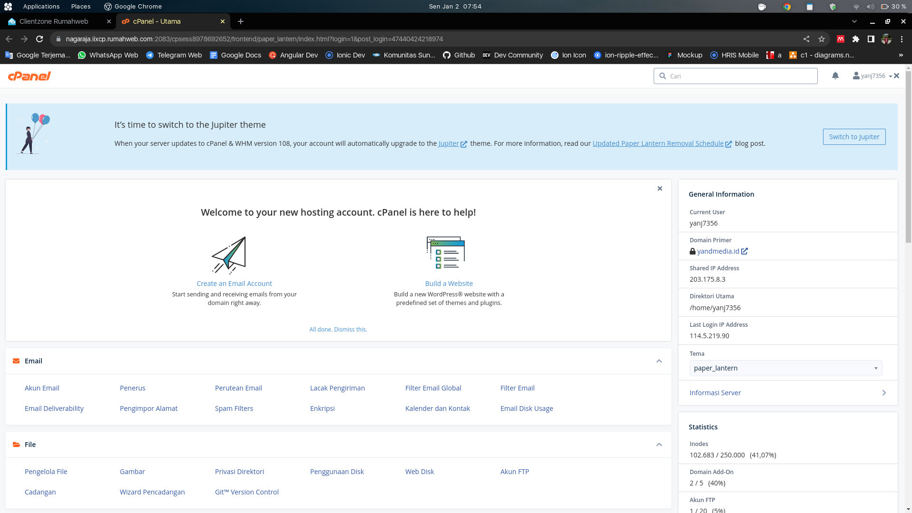

Demo : Domain registration

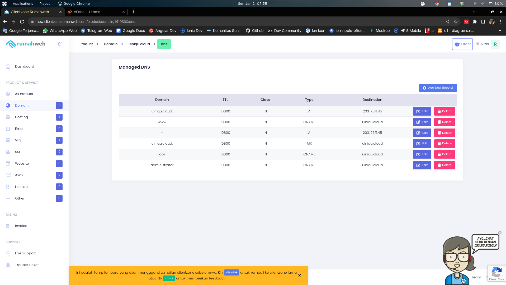

### CLO-0212

Demo : HTML Responsive Layout with Media Query & Flexbox

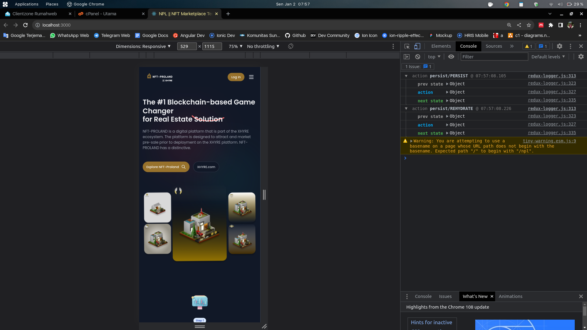

Demo : Javascript Data Transformation

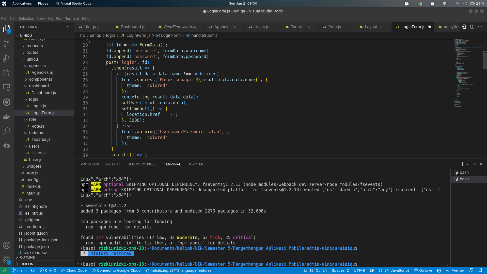

Demo : Browser API - Event Handling, Local Storage, Element manipulation

Demo : HTTP GET & POST using Form Action and Fetch API

Demo : PHP DB - Dynamic Web Page

Demo : PHP DB - Web Service

Demo : OOP-based PHP Project using Composer

Demo : Deploy PHP Project to Cpanel

<i>Diganti dengan Nginx & Gunycorn</i>

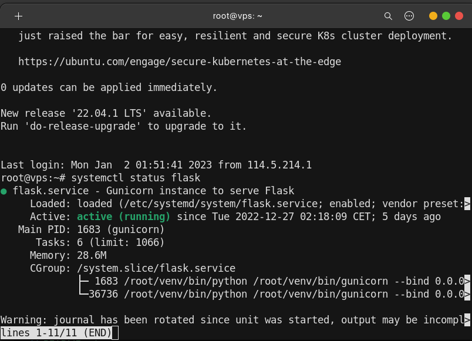

### CLO-0213

Demo : HTML Responsive Layout with Bootstrap

Demo : Single Page App with React & React-router

Demo : Dynamic Web Page using Laravel

<i>Diganti dengan React</i>

Demo : Web Service using Slim

<i>Diganti dengan Flask</i>

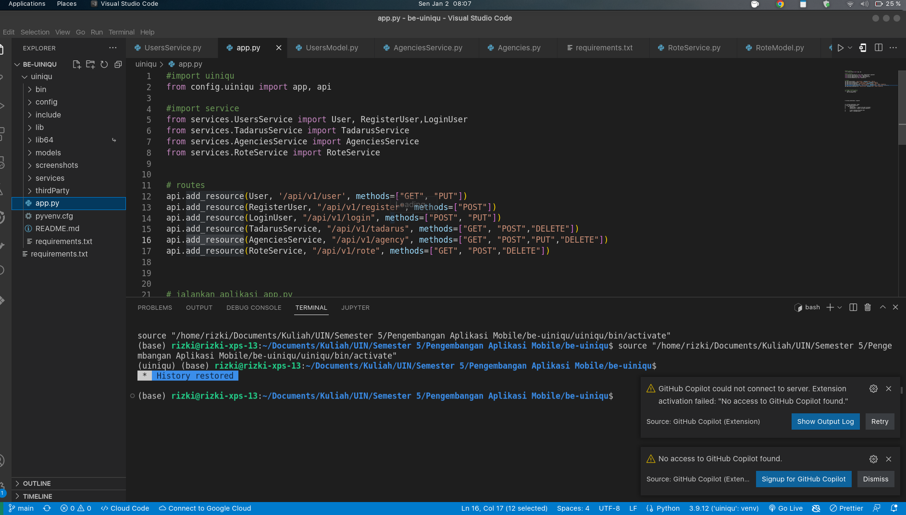

Demo : News Site using Wordpress

<i>Diganti dengan React</i>

